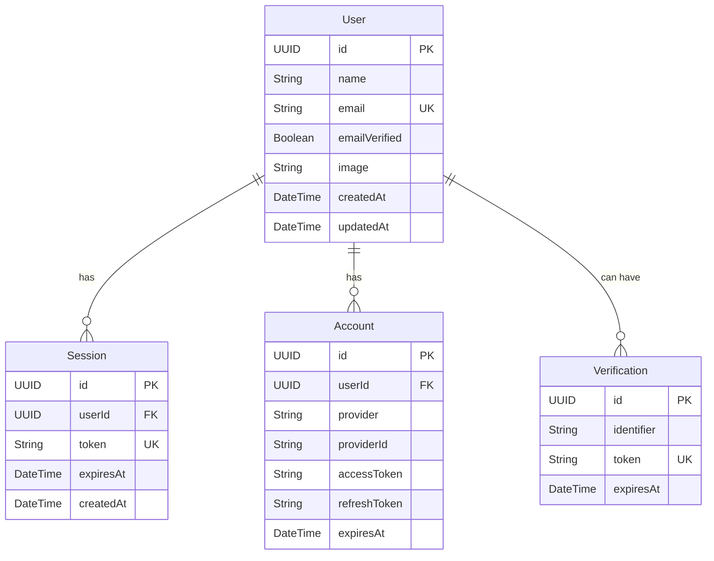

# Data Model: Better Auth Server Integration

**Feature**: 004-frontend-auth
**Date**: 2025-12-30
**Status**: Phase 1 Data Model

---

## Better Auth Schema

Better Auth automatically manages the following tables. No manual SQLModel definitions are required for these tables.

### User Table
**Purpose**: Stores user account information
**Managed by**: Better Auth library

| Field | Type | Constraints | Description |
|-------|------|-------------|-------------|
| `id` | UUID | Primary Key | Unique user identifier |
| `name` | String | Required | User's full name |
| `email` | String | Unique, Required | User's email address |
| `emailVerified` | Boolean | Default: false | Email verification status |
| `image` | String | Optional | User avatar URL |
| `createdAt` | DateTime | Required | Account creation timestamp |
| `updatedAt` | DateTime | Required | Last update timestamp |

**Indexes**:
- `id` (primary)
- `email` (unique)

---

### Session Table
**Purpose**: Stores active user sessions
**Managed by**: Better Auth library

| Field | Type | Constraints | Description |
|-------|------|-------------|-------------|
| `id` | UUID | Primary Key | Unique session identifier |
| `userId` | UUID | Foreign Key | References User.id |
| `token` | String | Unique, Required | Session token (JWT) |
| `expiresAt` | DateTime | Required | Session expiration timestamp |
| `createdAt` | DateTime | Required | Session creation timestamp |

**Indexes**:
- `id` (primary)
- `token` (unique)
- `userId` (for session lookup)

---

### Account Table
**Purpose**: Stores authentication provider information
**Managed by**: Better Auth library

| Field | Type | Constraints | Description |
|-------|------|-------------|-------------|
| `id` | UUID | Primary Key | Unique account identifier |
| `userId` | UUID | Foreign Key | References User.id |
| `provider` | String | Required | Auth provider name (e.g., "email") |
| `providerId` | String | Required | User ID from provider |
| `accessToken` | String | Optional | OAuth access token |
| `refreshToken` | String | Optional | OAuth refresh token |
| `expiresAt` | DateTime | Optional | Token expiration |

**Indexes**:
- `id` (primary)
- `userId, provider` (composite)

---

### Verification Table
**Purpose**: Stores email verification tokens
**Managed by**: Better Auth library

| Field | Type | Constraints | Description |
|-------|------|-------------|-------------|
| `id` | UUID | Primary Key | Unique verification identifier |
| `identifier` | String | Required | Email or user identifier |
| `token` | String | Unique, Required | Verification token |
| `expiresAt` | DateTime | Required | Token expiration timestamp |

**Indexes**:
- `id` (primary)
- `token` (unique)

---

## Entity Relationships



---

## Authentication Flow Data

### Registration Flow
1. **Input**: `name`, `email`, `password`
2. **Process**:
   - Better Auth creates User record
   - Hashes password (bcrypt/scrypt)
   - Creates Account record (provider: "email")
   - Generates session token
   - Returns session cookie
3. **Output**: User object + Session cookie

### Login Flow
1. **Input**: `email`, `password`
2. **Process**:
   - Better Auth validates credentials
   - Creates Session record
   - Returns session cookie
3. **Output**: User object + Session cookie

### Session Validation Flow
1. **Input**: Session cookie
2. **Process**:
   - Better Auth validates token
   - Checks session expiration
   - Returns user data
3. **Output**: User object or null

### Logout Flow
1. **Input**: Session cookie
2. **Process**:
   - Better Auth invalidates session
   - Clears session cookie
3. **Output**: Success response

---

## Data Validation Rules

### User Registration
```typescript
interface SignUpInput {
  name: string
  email: string
  password: string
}

// Validation Rules
name: {
  minLength: 2,
  maxLength: 50,
  required: true
}
email: {
  format: "email",
  required: true,
  unique: true
}
password: {
  minLength: 8,
  required: true,
  // Better Auth handles complexity
}
```

### User Login
```typescript
interface SignInInput {
  email: string
  password: string
}

// Validation Rules
email: {
  format: "email",
  required: true
}
password: {
  minLength: 8,
  required: true
}
```

---

## Security Considerations

### Password Storage
- **Algorithm**: Better Auth uses bcrypt/scrypt by default
- **Salt**: Automatically generated per user
- **Work Factor**: Configurable (default secure)
- **Never stored in plain text**

### Session Management
- **Token Type**: JWT (JSON Web Tokens)
- **Storage**: HTTP-only cookies
- **Expiration**: Configurable (default: 7 days)
- **Rotation**: Automatic on refresh

### Data Isolation
- **Multi-tenancy**: Each query scoped to `user_id`
- **Row-level security**: Application layer enforcement
- **No cross-user data access**

---

## Database Connection Configuration

### Neon PostgreSQL Setup
```typescript
// src/lib/auth/auth.ts
import { Pool } from "pg";

const pool = new Pool({
  connectionString: process.env.DATABASE_URL,
  ssl: {
    rejectUnauthorized: false // Required for Neon
  },
  max: 10, // Connection pool size
  idleTimeoutMillis: 30000,
  connectionTimeoutMillis: 2000,
});
```

### Better Auth Adapter
```typescript
import { betterAuth } from "better-auth";
import { pgAdapter } from "@better-auth/pg";

export const auth = betterAuth({
  database: pgAdapter(pool),
  // ... other config
});
```

---

## Migration Strategy

### Phase 1: Initial Setup
- Better Auth creates tables automatically
- No manual migrations needed
- Tables: user, session, account, verification

### Phase 2: Application Tables
- Tasks, projects, etc. use SQLModel
- Separate from Better Auth tables
- Manual migrations via SQLModel

### Phase 3: Future Enhancements
- OAuth providers (Google, GitHub)
- Two-factor authentication
- Password reset tokens
- Account deletion

---

## Testing Data Strategy

### Development
- Use real Neon database
- Create test users manually
- Clean up between tests

### Demo Mode
- Client-side mock data only
- No database interaction
- Disabled when `NEXT_PUBLIC_DEMO_MODE=false`

### Production
- Real Neon database
- Proper user data
- Secure authentication

---

## Performance Considerations

### Connection Pooling
- **Size**: 10 connections (Neon limit: 100)
- **Timeout**: 30s idle, 2s connection
- **Reuse**: Yes, via Pool

### Indexing
- Automatic on primary keys
- Unique constraints create indexes
- Foreign keys indexed

### Query Optimization
- Better Auth handles optimization
- No complex joins needed
- Simple lookups by ID/email

---

## Rollback Plan

If implementation fails:
1. Restore original proxy route
2. Revert client baseURL
3. Remove `pg` and `@better-auth/pg`
4. Auth falls back to demo mode or external backend
5. Database tables remain but unused

---

## Next Steps

1. **Create**: `src/lib/auth/auth.ts` (server config)
2. **Update**: `src/app/api/auth/[...all]/route.ts`
3. **Update**: `src/lib/auth/auth-client.ts`
4. **Install**: `pg` and `@better-auth/pg`
5. **Configure**: Environment variables
6. **Test**: All authentication flows