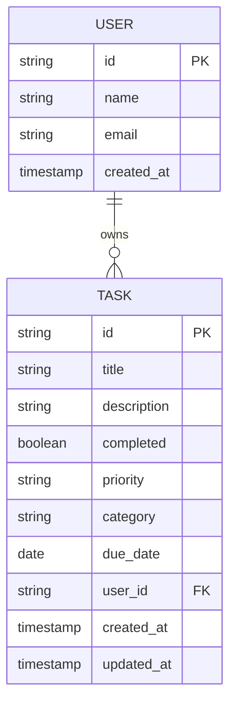

# Data Model: FastAPI Backend

**Feature**: FastAPI Backend for Todo App
**Branch**: `005-fastapi-backend`
**Date**: 2025-12-31

---

## Entity Relationship Diagram



---

## Task Entity

### SQLModel Definition

```python
from datetime import datetime, date
from typing import Optional
from uuid import UUID, uuid4
from sqlmodel import Field, SQLModel
from enum import Enum

class Priority(str, Enum):
    LOW = "low"
    MEDIUM = "medium"
    HIGH = "high"

class Category(str, Enum):
    WORK = "work"
    PERSONAL = "personal"
    SHOPPING = "shopping"
    HEALTH = "health"
    OTHER = "other"

class Task(SQLModel, table=True):
    """Task entity - represents a single todo item owned by a user"""

    id: UUID = Field(default_factory=uuid4, primary_key=True)
    title: str = Field(min_length=1, max_length=200)
    description: Optional[str] = Field(default=None, max_length=1000)
    completed: bool = Field(default=False)
    priority: Priority = Field(default=Priority.MEDIUM)
    category: Category = Field(default=Category.OTHER)
    due_date: Optional[date] = Field(default=None)
    user_id: str = Field(index=True)  # References Better Auth user.id
    created_at: datetime = Field(default_factory=datetime.utcnow)
    updated_at: datetime = Field(default_factory=datetime.utcnow)

    class Config:
        arbitrary_types_allowed = True
        json_encoders = {
            UUID: lambda v: str(v),
            datetime: lambda v: v.isoformat(),
            date: lambda v: v.isoformat()
        }
```

### Database Schema (PostgreSQL)

```sql
CREATE TABLE IF NOT EXISTS task (
    id UUID PRIMARY KEY DEFAULT gen_random_uuid(),
    title VARCHAR(200) NOT NULL,
    description VARCHAR(1000),
    completed BOOLEAN NOT NULL DEFAULT FALSE,
    priority VARCHAR(10) NOT NULL CHECK (priority IN ('low', 'medium', 'high')),
    category VARCHAR(20) NOT NULL CHECK (category IN ('work', 'personal', 'shopping', 'health', 'other')),
    due_date DATE,
    user_id VARCHAR(255) NOT NULL,
    created_at TIMESTAMP WITH TIME ZONE NOT NULL DEFAULT NOW(),
    updated_at TIMESTAMP WITH TIME ZONE NOT NULL DEFAULT NOW()
);

-- Indexes for performance
CREATE INDEX idx_task_user_id ON task(user_id);
CREATE INDEX idx_task_completed ON task(completed);
CREATE INDEX idx_task_priority ON task(priority);
CREATE INDEX idx_task_category ON task(category);
CREATE INDEX idx_task_due_date ON task(due_date);

-- Foreign key constraint (if user table exists)
-- ALTER TABLE task ADD CONSTRAINT fk_task_user
--   FOREIGN KEY (user_id) REFERENCES "user"(id) ON DELETE CASCADE;
```

---

## User Entity (Read-Only)

### Source: Better Auth

The User entity exists in the Better Auth `user` table and is **read-only** from the backend perspective.

**Expected Schema** (from Better Auth):
```sql
CREATE TABLE IF NOT EXISTS "user" (
    id VARCHAR(255) PRIMARY KEY,
    name VARCHAR(255),
    email VARCHAR(255) UNIQUE NOT NULL,
    email_verified BOOLEAN DEFAULT FALSE,
    image VARCHAR(512),
    created_at TIMESTAMP WITH TIME ZONE DEFAULT NOW(),
    updated_at TIMESTAMP WITH TIME ZONE DEFAULT NOW()
);
```

### Backend Representation

```python
from datetime import datetime
from typing import Optional
from pydantic import BaseModel

class User(BaseModel):
    """Read-only user model from Better Auth"""
    id: str
    name: Optional[str]
    email: str
    email_verified: bool = False
    image: Optional[str]
    created_at: datetime
    updated_at: datetime
```

---

## Validation Rules

### Task Creation

**Required Fields:**
- `title`: 1-200 characters, non-empty

**Optional Fields:**
- `description`: max 1000 characters
- `priority`: must be one of: "low", "medium", "high"
- `category`: must be one of: "work", "personal", "shopping", "health", "other"
- `due_date`: ISO 8601 date format

**Default Values:**
- `completed`: false
- `priority`: "medium"
- `category`: "other"

### Task Update

**Immutable Fields:**
- `id`
- `user_id`
- `created_at`

**Mutable Fields:**
- All other fields can be updated
- `updated_at` must be set to current timestamp on any update

---

## Business Rules

### Ownership Enforcement

**Rule**: Every task must be scoped to the authenticated user.

**Implementation**:
```python
# All queries must include user_id filter
async def get_user_tasks(user_id: str, session: AsyncSession):
    result = await session.exec(
        select(Task).where(Task.user_id == user_id).order_by(Task.created_at.desc())
    )
    return result.all()
```

### Data Integrity

**Rule**: Task user_id must match authenticated user from JWT.

**Implementation**:
```python
# In route handlers
@router.post("/api/{user_id}/tasks")
async def create_task(user_id: str, task: TaskCreate, current_user: str = Depends(get_current_user)):
    if user_id != current_user:
        raise HTTPException(status_code=403, detail="Access denied")
    # ... create task with user_id = current_user
```

### Cascading Deletes

**Rule**: When a user is deleted from Better Auth, their tasks should be deleted.

**Implementation**:
```sql
-- Add foreign key constraint after user table exists
ALTER TABLE task ADD CONSTRAINT fk_task_user
    FOREIGN KEY (user_id) REFERENCES "user"(id) ON DELETE CASCADE;
```

---

## Query Patterns

### Filtering

**Status Filter**:
```sql
WHERE completed = true  -- completed tasks
WHERE completed = false -- pending tasks
```

**Priority Filter**:
```sql
WHERE priority IN ('high', 'medium')  -- multiple priorities
```

**Category Filter**:
```sql
WHERE category = 'work'
```

**Search**:
```sql
WHERE title ILIKE '%search_term%' OR description ILIKE '%search_term%'
```

### Sorting

```sql
ORDER BY created_at DESC    -- newest first
ORDER BY due_date ASC       -- soonest first
ORDER BY priority DESC      -- high priority first
ORDER BY title ASC          -- alphabetical
```

### Aggregation (Profile Stats)

```sql
SELECT
    COUNT(*) as total_tasks,
    COUNT(CASE WHEN completed = true THEN 1 END) as completed_tasks,
    COUNT(CASE WHEN completed = false THEN 1 END) as pending_tasks
FROM task
WHERE user_id = $1
```

---

## Performance Considerations

### Index Strategy

1. **Primary Lookups**: `idx_task_user_id` - Most queries filter by user
2. **Status Queries**: `idx_task_completed` - Common filter
3. **Priority/Category**: `idx_task_priority`, `idx_task_category` - Enum filters
4. **Due Date**: `idx_task_due_date` - Sorting and filtering

### Query Optimization

- Always use `WHERE user_id = ?` to leverage index and ensure security
- Use `LIMIT` and `OFFSET` for pagination on task lists
- Consider covering indexes for common query patterns
- Monitor query performance with `EXPLAIN ANALYZE`

---

## Migration Strategy

### Initial Setup

```bash
# Create the task table
cd phase-2/backend
uv run python -c "
from sqlmodel import SQLModel
from backend.database import engine
from backend.models.task import Task
SQLModel.metadata.create_all(engine)
"
```

### Future Migrations

For schema changes, use SQLModel's migration patterns or tools like Alembic:

```bash
# Generate migration
uv run alembic revision --autogenerate -m "add new field"

# Apply migration
uv run alembic upgrade head
```

---

## Integration Points

### Better Auth Integration

**JWT Token Structure** (expected from frontend):
```json
{
  "sub": "user-uuid-here",
  "email": "user@example.com",
  "exp": 1234567890,
  "iat": 1234567890
}
```

**User ID Reference**:
- Task.user_id references Better Auth user.id
- JWT.sub contains the user.id for verification

### Frontend Data Flow

1. Frontend authenticates with Better Auth
2. Frontend receives JWT token
3. Frontend calls backend with `Authorization: Bearer <token>`
4. Backend verifies JWT and extracts user_id
5. Backend queries tasks WHERE user_id = extracted_user_id
6. Backend returns filtered results

---

## Testing Data

### Sample Test Data

```python
# Test task for user "user-123"
{
    "title": "Complete project documentation",
    "description": "Write comprehensive docs for the FastAPI backend",
    "priority": "high",
    "category": "work",
    "due_date": "2025-01-15",
    "completed": False
}

# Test task for user "user-456" (different user)
{
    "title": "Buy groceries",
    "description": "Milk, eggs, bread",
    "priority": "medium",
    "category": "shopping",
    "completed": False
}
```

### Edge Cases

- **Empty title**: Should fail validation
- **Title too long**: >200 chars should fail
- **Invalid priority**: "ultra-high" should fail
- **Missing user_id**: Should fail authentication
- **Cross-user access**: Should return 403 Forbidden