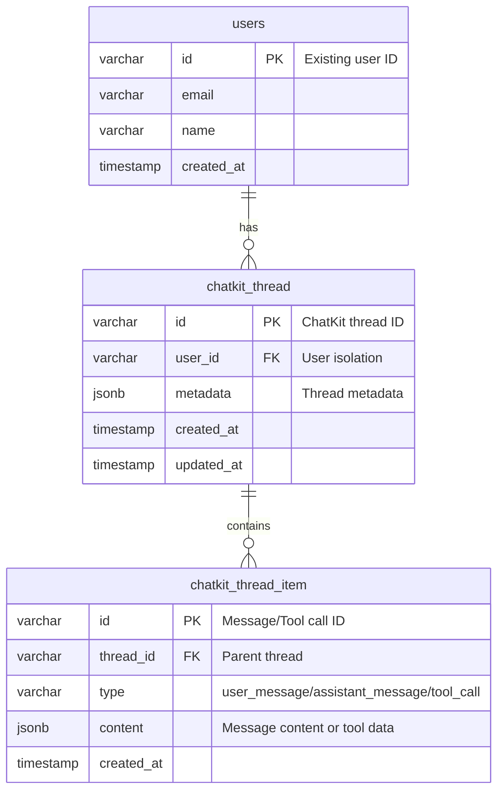

# ChatKit Data Model Extensions

**Date**: 2026-01-16
**Status**: Design Complete
**Scope**: PostgreSQL schema extensions for ChatKit thread persistence with user isolation

## Overview

This document defines the database schema extensions required for ChatKit integration. The design maintains strict user isolation (Zero-Trust Multi-Tenancy principle) and leverages existing Neon PostgreSQL infrastructure.

## Entity Relationship Diagram



## Database Schema

### 1. ChatKit Threads Table

**Purpose**: Stores ChatKit conversation threads with user isolation

**Table Name**: `chatkit_thread`

**Columns**:
```sql
CREATE TABLE chatkit_thread (
    -- Primary identifier (ChatKit format: thread_<uuid>)
    id VARCHAR(255) PRIMARY KEY,

    -- User isolation - Foreign key to existing users table
    "userId" VARCHAR(255) NOT NULL REFERENCES users(id) ON DELETE CASCADE,

    -- Thread metadata (title, model, etc.)
    metadata JSONB DEFAULT '{}'::jsonb,

    -- Timestamps
    "createdAt" TIMESTAMPTZ DEFAULT NOW(),
    "updatedAt" TIMESTAMPTZ DEFAULT NOW(),

    -- Constraints
    CONSTRAINT chatkit_thread_user_id_check CHECK ("userId" ~ '^[a-zA-Z0-9_-]+$')
);

-- Indexes for performance
CREATE INDEX idx_chatkit_thread_user ON chatkit_thread("userId");
CREATE INDEX idx_chatkit_thread_updated ON chatkit_thread("updatedAt");
CREATE INDEX idx_chatkit_thread_created ON chatkit_thread("createdAt");
```

**Metadata Schema**:
```json
{
  "title": "Conversation about task management",
  "model": "gpt-4o",
  "user_context": {
    "id": "user_123",
    "name": "John Doe",
    "preferences": {
      "language": "ur",
      "timezone": "Asia/Karachi"
    }
  },
  "page_context": {
    "url": "/chatbot",
    "referrer": "/tasks",
    "timestamp": "2026-01-16T10:30:00Z"
  }
}
```

### 2. ChatKit Thread Items Table

**Purpose**: Stores individual messages, tool calls, and system events within a thread

**Table Name**: `chatkit_thread_item`

**Columns**:
```sql
CREATE TABLE chatkit_thread_item (
    -- Primary identifier (ChatKit format: item_<uuid>)
    id VARCHAR(255) PRIMARY KEY,

    -- Thread relationship
    "threadId" VARCHAR(255) NOT NULL REFERENCES chatkit_thread(id) ON DELETE CASCADE,

    -- Item type
    type VARCHAR(50) NOT NULL CHECK (type IN (
        'user_message',
        'assistant_message',
        'tool_call',
        'tool_result',
        'system_message',
        'error'
    )),

    -- Content (flexible JSON for different message types)
    content JSONB NOT NULL,

    -- Timestamps
    "createdAt" TIMESTAMPTZ DEFAULT NOW(),

    -- Constraints
    CONSTRAINT chatkit_thread_item_type_check CHECK (type ~ '^[a-z_]+$')
);

-- Indexes for performance
CREATE INDEX idx_chatkit_item_thread ON chatkit_thread_item("threadId");
CREATE INDEX idx_chatkit_item_created ON chatkit_thread_item("createdAt");
CREATE INDEX idx_chatkit_item_type ON chatkit_thread_item(type);
```

**Content Schemas by Type**:

#### User Message
```json
{
  "type": "user_message",
  "content": [
    {
      "type": "text",
      "text": "Create a task for tomorrow"
    }
  ],
  "metadata": {
    "user_id": "user_123",
    "timestamp": "2026-01-16T10:30:00Z"
  }
}
```

#### Assistant Message
```json
{
  "type": "assistant_message",
  "content": [
    {
      "type": "text",
      "text": "I've created a task for you: 'Buy groceries' due tomorrow."
    }
  ],
  "metadata": {
    "agent_name": "Orchestrator",
    "response_time_ms": 150,
    "model": "gpt-4o"
  }
}
```

#### Tool Call
```json
{
  "type": "tool_call",
  "content": {
    "tool_name": "create_task",
    "arguments": {
      "user_id": "user_123",
      "title": "Buy groceries",
      "due_date": "2026-01-17",
      "priority": "medium"
    },
    "tool_call_id": "call_abc123",
    "status": "completed"
  },
  "metadata": {
    "duration_ms": 45,
    "mcp_server": "task-manager"
  }
}
```

#### Tool Result
```json
{
  "type": "tool_result",
  "content": {
    "tool_call_id": "call_abc123",
    "result": {
      "success": true,
      "data": {
        "id": "task_456",
        "title": "Buy groceries",
        "status": "pending",
        "created_at": "2026-01-16T10:30:01Z"
      }
    }
  }
}
```

#### Error
```json
{
  "type": "error",
  "content": {
    "message": "Failed to create task: Invalid due date",
    "code": "VALIDATION_ERROR",
    "details": {
      "field": "due_date",
      "rule": "must_be_future_date"
    }
  },
  "metadata": {
    "retryable": true,
    "suggested_fix": "Use a future date"
  }
}
```

## User Isolation Implementation

### Query Patterns

All queries MUST include user isolation:

```python
# ✅ CORRECT - User isolated
async def get_user_threads(user_id: str, limit: int = 50):
    query = """
        SELECT * FROM chatkit_thread
        WHERE "userId" = :user_id
        ORDER BY "updatedAt" DESC
        LIMIT :limit
    """
    return await session.execute(query, {"user_id": user_id, "limit": limit})

# ❌ WRONG - No user isolation
async def get_all_threads():
    query = "SELECT * FROM chatkit_thread"  # SECURITY VIOLATION
    return await session.execute(query)
```

### Row-Level Security (Application Layer)

```python
class PostgresChatKitStore:
    def _get_user_id_from_context(self, context: dict) -> str:
        """Extract user ID for data isolation"""
        user = context.get('metadata', {}).get('userInfo', {})
        user_id = user.get('id')
        if not user_id:
            raise ValueError("User ID required for data isolation")
        return user_id

    def _validate_thread_access(self, thread_id: str, user_id: str) -> bool:
        """Verify user owns the thread"""
        return thread_id.startswith(f"thread_{user_id}_")
```

## Migration Strategy

### Step 1: Create Tables
```sql
-- Run this migration to add ChatKit tables
-- File: migrations/008_add_chatkit_tables.sql

CREATE TABLE chatkit_thread (
    id VARCHAR(255) PRIMARY KEY,
    "userId" VARCHAR(255) NOT NULL REFERENCES users(id) ON DELETE CASCADE,
    metadata JSONB DEFAULT '{}'::jsonb,
    "createdAt" TIMESTAMPTZ DEFAULT NOW(),
    "updatedAt" TIMESTAMPTZ DEFAULT NOW(),
    CONSTRAINT chatkit_thread_user_id_check CHECK ("userId" ~ '^[a-zA-Z0-9_-]+$')
);

CREATE TABLE chatkit_thread_item (
    id VARCHAR(255) PRIMARY KEY,
    "threadId" VARCHAR(255) NOT NULL REFERENCES chatkit_thread(id) ON DELETE CASCADE,
    type VARCHAR(50) NOT NULL CHECK (type IN (
        'user_message', 'assistant_message', 'tool_call',
        'tool_result', 'system_message', 'error'
    )),
    content JSONB NOT NULL,
    "createdAt" TIMESTAMPTZ DEFAULT NOW(),
    CONSTRAINT chatkit_thread_item_type_check CHECK (type ~ '^[a-z_]+$')
);

-- Indexes
CREATE INDEX idx_chatkit_thread_user ON chatkit_thread("userId");
CREATE INDEX idx_chatkit_thread_updated ON chatkit_thread("updatedAt");
CREATE INDEX idx_chatkit_item_thread ON chatkit_thread_item("threadId");
CREATE INDEX idx_chatkit_item_created ON chatkit_thread_item("createdAt");
CREATE INDEX idx_chatkit_item_type ON chatkit_thread_item(type);
```

### Step 2: Backward Compatibility
- Existing chat functionality remains unchanged
- ChatKit tables are additive only
- No data migration required from existing system

## Performance Considerations

### Query Optimization

1. **Thread Listing**: Use composite index on `(userId, updatedAt)`
   ```sql
   CREATE INDEX idx_chatkit_thread_user_updated
   ON chatkit_thread("userId", "updatedAt" DESC);
   ```

2. **Thread Items**: Use covering index for common queries
   ```sql
   CREATE INDEX idx_chatkit_item_thread_type_created
   ON chatkit_thread_item("threadId", type, "createdAt");
   ```

3. **Pagination**: Always use cursor-based pagination
   ```sql
   SELECT * FROM chatkit_thread_item
   WHERE "threadId" = :thread_id
   ORDER BY "createdAt" ASC
   LIMIT :limit OFFSET :offset;
   ```

### Storage Estimates

- **Per Message**: ~2-5KB (text + metadata)
- **Per Thread**: ~10-50KB (10-20 messages)
- **Per User**: ~1-5MB (100 threads, 1000 messages)
- **1000 Users**: ~1-5GB total storage

## Security Considerations

### Data Isolation
- ✅ All queries include `WHERE "userId" = :user_id`
- ✅ Foreign key constraints enforce referential integrity
- ✅ ON DELETE CASCADE removes orphaned data
- ✅ Application-layer validation before DB access

### SQL Injection Prevention
- ✅ Use parameterized queries exclusively
- ✅ Validate all input parameters
- ✅ Use Pydantic models for input validation

### Encryption
- ✅ Neon PostgreSQL provides encryption at rest
- ✅ TLS for connections (enforced by Neon)
- ✅ Consider field-level encryption for sensitive metadata

## API Contract Integration

### Thread Creation Flow

```typescript
// Frontend → Backend → ChatKit
1. User sends message via ChatKit UI
2. ChatKit creates thread → returns thread_id
3. Backend stores thread in PostgreSQL with user isolation
4. Thread metadata includes user context
```

### Message Storage Flow

```typescript
// Real-time message persistence
1. User sends message → ChatKit UI
2. ChatKit → Backend (via custom fetch)
3. Backend stores in chatkit_thread_item
4. Agent processes → stores response
5. Both user and assistant messages persisted
```

### Tool Call Storage Flow

```typescript
// MCP tool execution tracking
1. Agent calls MCP tool
2. Backend stores tool_call item
3. Tool executes → result returned
4. Backend stores tool_result item
5. ChatKit displays both in UI
```

## Validation Rules

### Thread ID Format
- Must start with `thread_`
- Must include user ID: `thread_{user_id}_{uuid}`
- Max length: 255 characters
- Allowed chars: alphanumeric, underscore, hyphen

### Message Type Validation
- Must be one of: `user_message`, `assistant_message`, `tool_call`, `tool_result`, `system_message`, `error`
- Content must be valid JSON
- Timestamps must be UTC

### User Isolation Validation
- All operations must include user context
- Thread access must be validated
- No cross-user data access permitted

## Testing Data Model

### Test Cases

1. **User Isolation**: User A cannot access User B's threads
2. **Thread Creation**: Valid thread creation with user context
3. **Message Storage**: Different message types stored correctly
4. **Tool Call Tracking**: Tool calls and results linked properly
5. **Pagination**: Large thread lists paginate correctly
6. **Cascade Delete**: User deletion removes all related data
7. **Concurrent Access**: Multiple users can create threads simultaneously

### Sample Test Data

```sql
-- User 1
INSERT INTO chatkit_thread (id, "userId", metadata) VALUES
('thread_user1_abc123', 'user1', '{"title": "Task discussion"}');

INSERT INTO chatkit_thread_item (id, "threadId", type, content) VALUES
('item_user1_msg1', 'thread_user1_abc123', 'user_message',
 '{"content": [{"type": "text", "text": "Create a task"}]}');

-- User 2 (isolated)
INSERT INTO chatkit_thread (id, "userId", metadata) VALUES
('thread_user2_xyz789', 'user2', '{"title": "Different conversation"}');
```

## Migration Rollback Plan

If ChatKit integration fails:

1. **Stop using ChatKit UI** - revert to custom frontend
2. **Keep tables** - no data loss, can be used later
3. **Optional cleanup** - drop tables if needed:
   ```sql
   DROP TABLE IF EXISTS chatkit_thread_item;
   DROP TABLE IF EXISTS chatkit_thread;
   ```

## Next Steps

1. **Implement Store**: Create `PostgresChatKitStore` with all 14 required methods
2. **Add Migrations**: Create SQL migration file for new tables
3. **Test Schema**: Validate constraints and indexes
4. **Performance Test**: Verify query performance with expected data volume
5. **Security Audit**: Review user isolation implementation

---

**Design Status**: ✅ Complete
**Review Required**: ✅ Security team review for user isolation
**Implementation Ready**: ✅ Yes