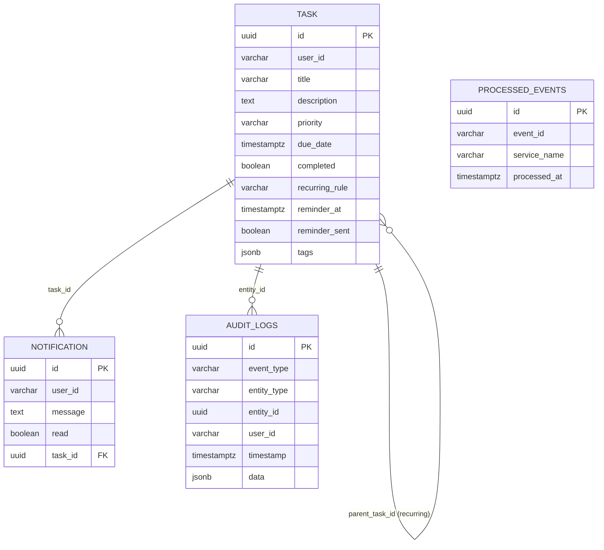

# Data Model: Event-Driven Microservices with Dapr

**Feature**: 011-microservices-dapr
**Date**: 2026-02-04

## Overview

This document describes the data model for the event-driven microservices architecture. The existing `task`, `notifications`, and `audit_logs` tables remain unchanged. A new `processed_events` table is added for idempotency tracking.

## Existing Tables (Unchanged)

### Task Table

**Source**: `002_phase5_features.sql`

```sql
CREATE TABLE task (
    id UUID PRIMARY KEY,
    user_id VARCHAR(255) NOT NULL,
    title VARCHAR(255) NOT NULL,
    description TEXT,
    priority VARCHAR(20) DEFAULT 'medium',
    due_date TIMESTAMPTZ,
    completed BOOLEAN DEFAULT FALSE,
    completed_at TIMESTAMPTZ,
    created_at TIMESTAMPTZ DEFAULT NOW(),
    updated_at TIMESTAMPTZ DEFAULT NOW(),

    -- Phase 5 extensions
    recurring_rule VARCHAR(20),           -- daily/weekly/monthly
    recurring_end_date TIMESTAMPTZ,
    parent_task_id UUID REFERENCES task(id),
    reminder_at TIMESTAMPTZ,
    reminder_sent BOOLEAN DEFAULT FALSE,
    tags JSONB DEFAULT '[]'::jsonb
);
```

**Fields**:
- `id`: UUID primary key
- `user_id`: Owner identifier (for multi-tenancy)
- `title`: Task title
- `description`: Optional detailed description
- `priority`: low/medium/high
- `due_date`: Optional due date
- `completed`: Completion status
- `completed_at`: When marked complete
- `created_at`: Creation timestamp
- `updated_at`: Last update timestamp
- `recurring_rule`: Recurrence pattern (daily/weekly/monthly)
- `recurring_end_date`: Optional end date for recurrence
- `parent_task_id`: For recurring task chains
- `reminder_at`: When to send reminder
- `reminder_sent`: Track if reminder was sent
- `tags`: JSONB array of tag strings

**Indexes**:
- Primary key on `id`
- Implicit index on `user_id` (for query filtering)

### Notifications Table

**Source**: `002_phase5_features.sql`

```sql
CREATE TABLE notifications (
    id UUID PRIMARY KEY,
    user_id VARCHAR(255) NOT NULL,
    message TEXT NOT NULL,
    read BOOLEAN DEFAULT FALSE,
    created_at TIMESTAMPTZ DEFAULT NOW(),
    task_id UUID REFERENCES task(id) ON DELETE CASCADE
);
```

**Fields**:
- `id`: UUID primary key
- `user_id`: Recipient identifier
- `message`: Notification message text
- `read`: Read/unread status
- `created_at`: Creation timestamp
- `task_id`: Optional link to related task

**Relationships**:
- `task_id` foreign key with CASCADE delete

### Audit Logs Table

**Source**: `002_phase5_features.sql`

```sql
CREATE TABLE audit_logs (
    id UUID PRIMARY KEY,
    event_type VARCHAR(50) NOT NULL,
    entity_type VARCHAR(50) NOT NULL,
    entity_id UUID NOT NULL,
    user_id VARCHAR(255) NOT NULL,
    timestamp TIMESTAMPTZ DEFAULT NOW(),
    data JSONB DEFAULT '{}'::jsonb
);
```

**Fields**:
- `id`: UUID primary key
- `event_type`: Type of event (TASK_CREATED, TASK_UPDATED, etc.)
- `entity_type`: Type of entity (task)
- `entity_id`: ID of the affected entity
- `user_id`: Who performed the action
- `timestamp`: When the event occurred
- `data`: JSONB payload with event details

**Event Types**:
- `TASK_CREATED`: New task created
- `TASK_UPDATED`: Task modified
- `TASK_COMPLETED`: Task marked complete
- `TASK_DELETED`: Task removed

## New Table: Processed Events

### Purpose

Track processed events to ensure idempotency in the at-least-once delivery system. Uses **Dapr State Store** backed by PostgreSQL instead of a custom table.

**Source**: `migrations/003_dapr_state.sql` (new)

```sql
CREATE TABLE IF NOT EXISTS state (
    key TEXT PRIMARY KEY,
    value JSONB,
    isbinary BOOLEAN DEFAULT FALSE,
    insertdate TIMESTAMP DEFAULT NOW(),
    updatedate TIMESTAMP DEFAULT NOW()
);
```

**Fields**:
- `key`: Unique key (format: `processed-{event_id}-{service_name}`)
- `value`: JSON payload with processing metadata
- `isbinary`: Dapr internal flag (always FALSE for this use case)
- `insertdate`/`updatedate`: Timestamps

> [!IMPORTANT]
> Idempotency is handled via utilities in `utils/dapr_state.py` and `utils/idempotency.py`.
> Do NOT create a `processed_events` table or `ProcessedEvent` SQLModel class.

**Usage via Dapr State Store**:
```python
from utils.idempotency import check_and_mark_processed

if await check_and_mark_processed(event_id, "audit-service"):
    return  # Skip duplicate
# Process event...
```

## Entity Relationships



## Data Flow

### Task Creation Flow

```
1. backend-api receives request
2. Insert into task table
3. Publish "task-created" event
4. audit-service receives event → Insert into audit_logs
5. audit-service records processing → Insert into processed_events
6. websocket-service receives event → Broadcast to clients
```

### Recurring Task Flow

```
1. User completes recurring task
2. backend-api marks task.completed = true
3. Publish "task-completed" event
4. recurring-service receives event
5. recurring-service checks processed_events (idempotency)
6. recurring-service creates next task → Insert into task
7. recurring-service publishes "task-created" for new task
```

### Reminder Flow

```
1. Dapr cron triggers every minute
2. notification-service queries: WHERE reminder_at <= NOW() AND reminder_sent = false
3. For each due task:
   a. Insert into notifications
   b. Update task.reminder_sent = true
   c. Publish "reminder-due" event
4. websocket-service broadcasts to user's connected clients
```

## State Transitions

### Task Lifecycle

```
┌─────────┐     create     ┌──────────┐
│  None   │ ──────────────► │  Active  │
└─────────┘                 └─────┬────┘
                                  │
                    ┌─────────────┼─────────────┐
                    │             │             │
                    ▼             ▼             ▼
              ┌─────────┐   ┌─────────┐   ┌─────────┐
              │ Update  │   │Complete │   │ Delete  │
              └────┬────┘   └────┬────┘   └─────────┘
                   │             │
                   │             │ (recurring)
                   │             ▼
                   │        ┌─────────┐
                   │        │  Active │◄── (new task created)
                   │        └─────────┘
                   │
                   ▼
              ┌─────────┐
              │  Active │
              └─────────┘
```

## Validation Rules

### Task Table

- `user_id`: Required, must match authenticated user
- `title`: Required, max 255 characters
- `priority`: Must be one of: low, medium, high
- `recurring_rule`: If set, must be: daily, weekly, or monthly
- `reminder_at`: If set, must be in the future (on create)
- `tags`: Must be valid JSONB array

### Notifications Table

- `user_id`: Required
- `message`: Required
- `read`: Defaults to false

### Audit Logs Table

- `event_type`: Required
- `entity_type`: Required
- `entity_id`: Required UUID
- `user_id`: Required

### Processed Events Table

- `event_id`: Required
- `service_name`: Required, must be valid service name
- Unique constraint on `(event_id, service_name)`

## Query Patterns

### Multi-Tenancy Filtering

All queries MUST include `user_id` filter:

```sql
-- Get user's tasks
SELECT * FROM task WHERE user_id = $1;

-- Get user's notifications
SELECT * FROM notifications WHERE user_id = $1;

-- Get user's audit logs
SELECT * FROM audit_logs WHERE user_id = $1;
```

### Idempotency Check

Before processing an event:

```sql
-- Check if already processed
SELECT * FROM processed_events
WHERE event_id = $1 AND service_name = $2;

-- If not found, process and record
INSERT INTO processed_events (event_id, service_name)
VALUES ($1, $2);
```

### Reminder Query

Find tasks with due reminders:

```sql
SELECT * FROM task
WHERE reminder_at <= NOW()
  AND reminder_sent = false
  AND completed = false;
```
